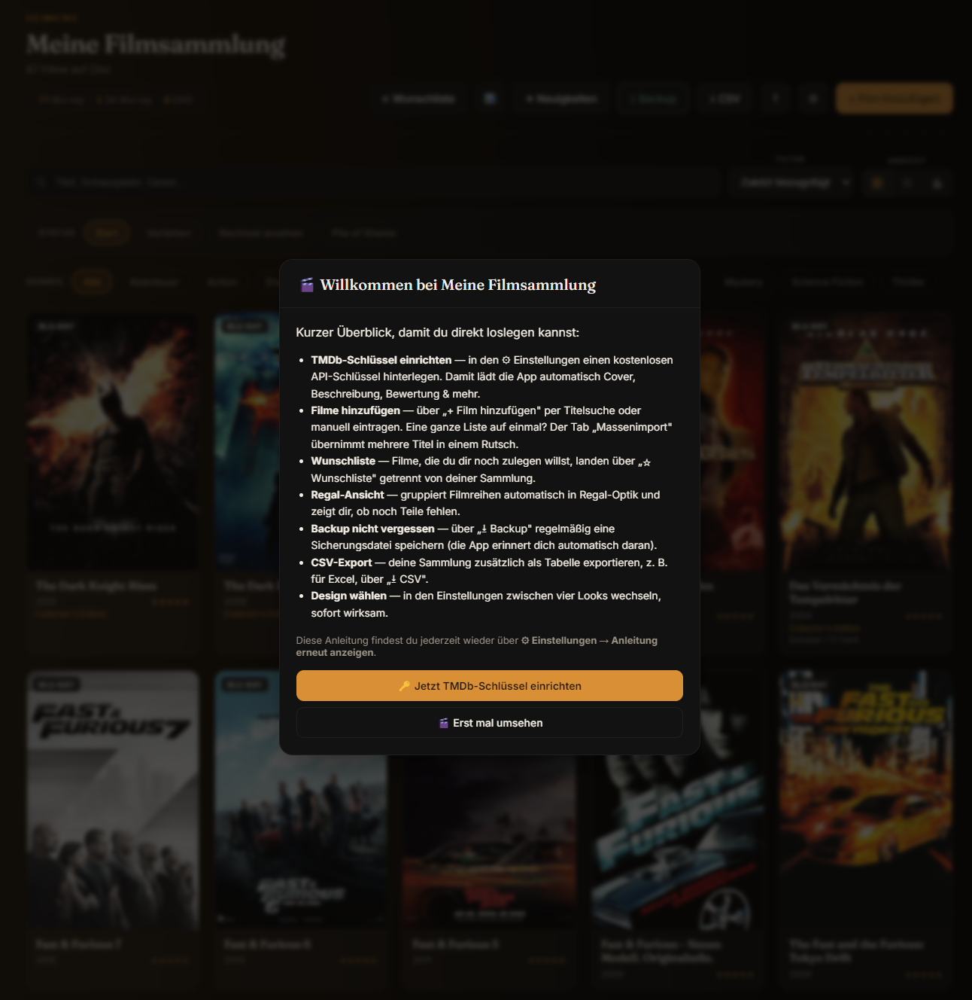
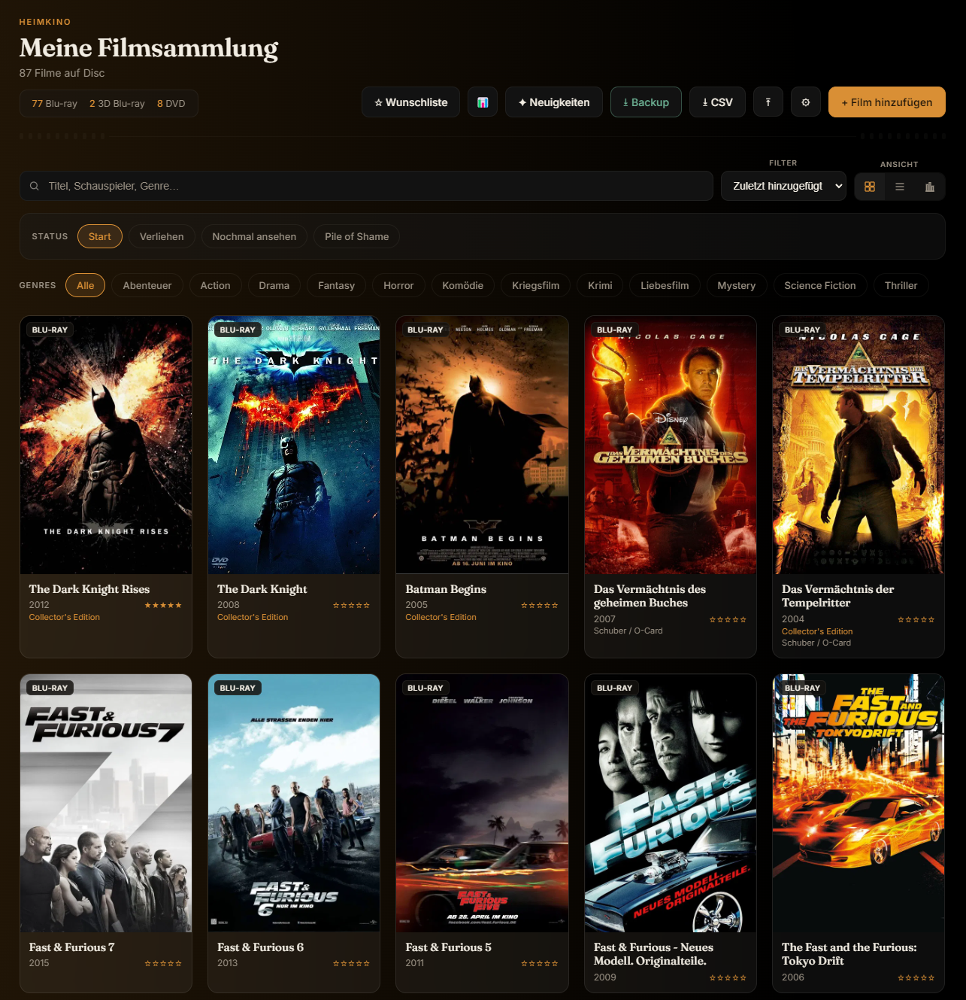
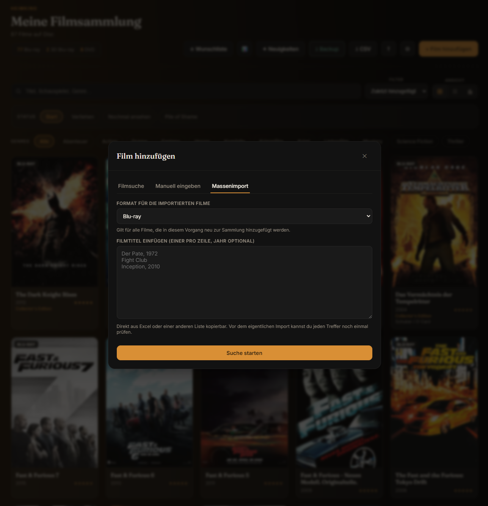
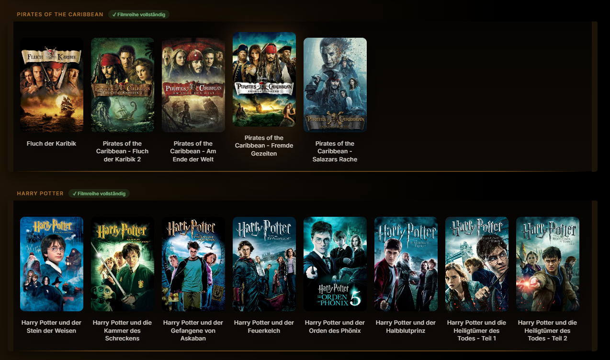
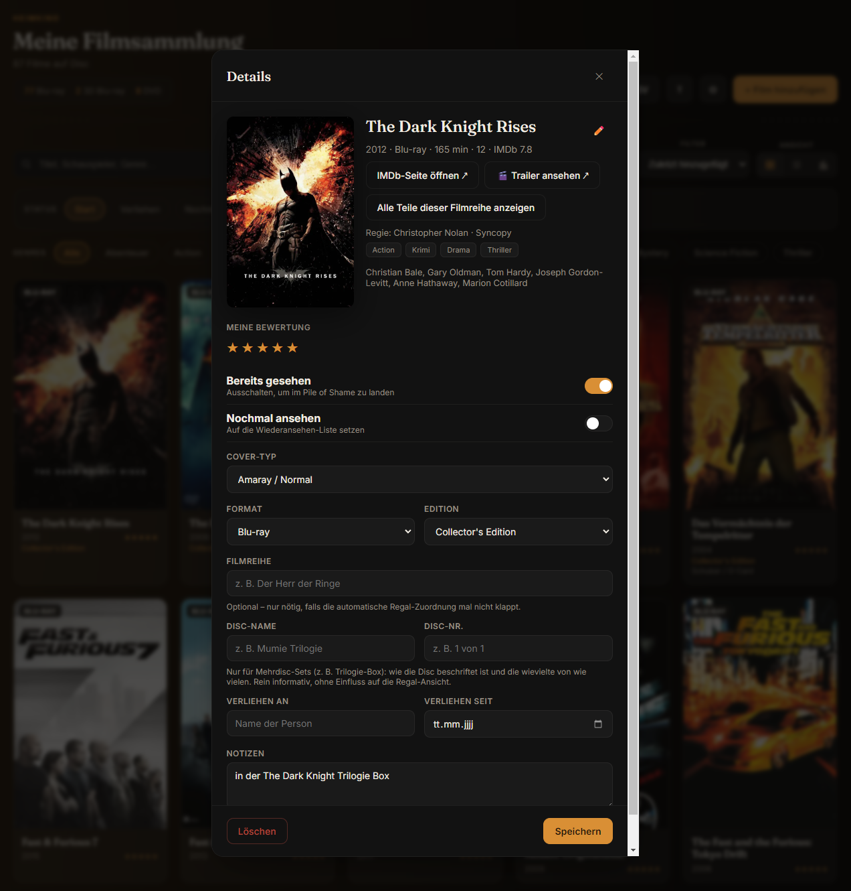
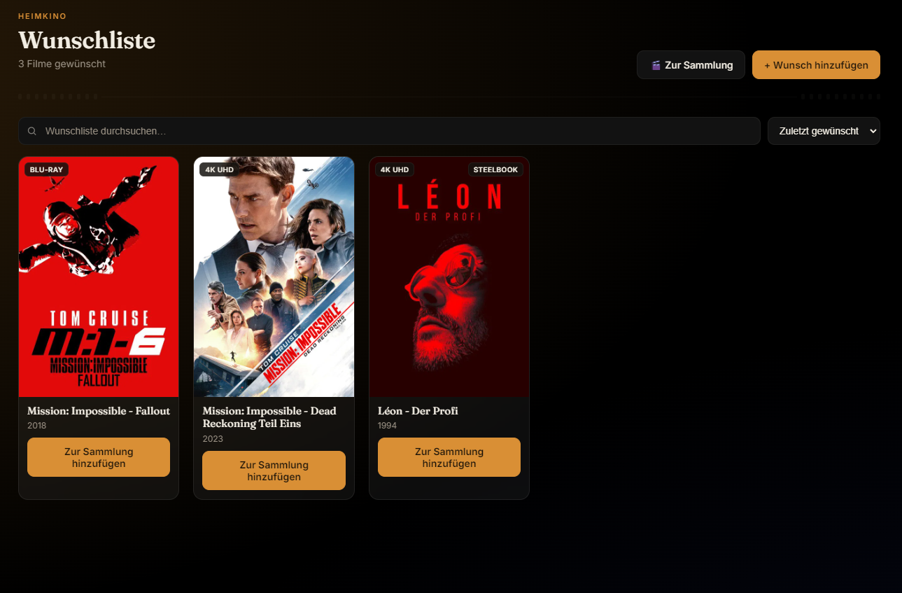
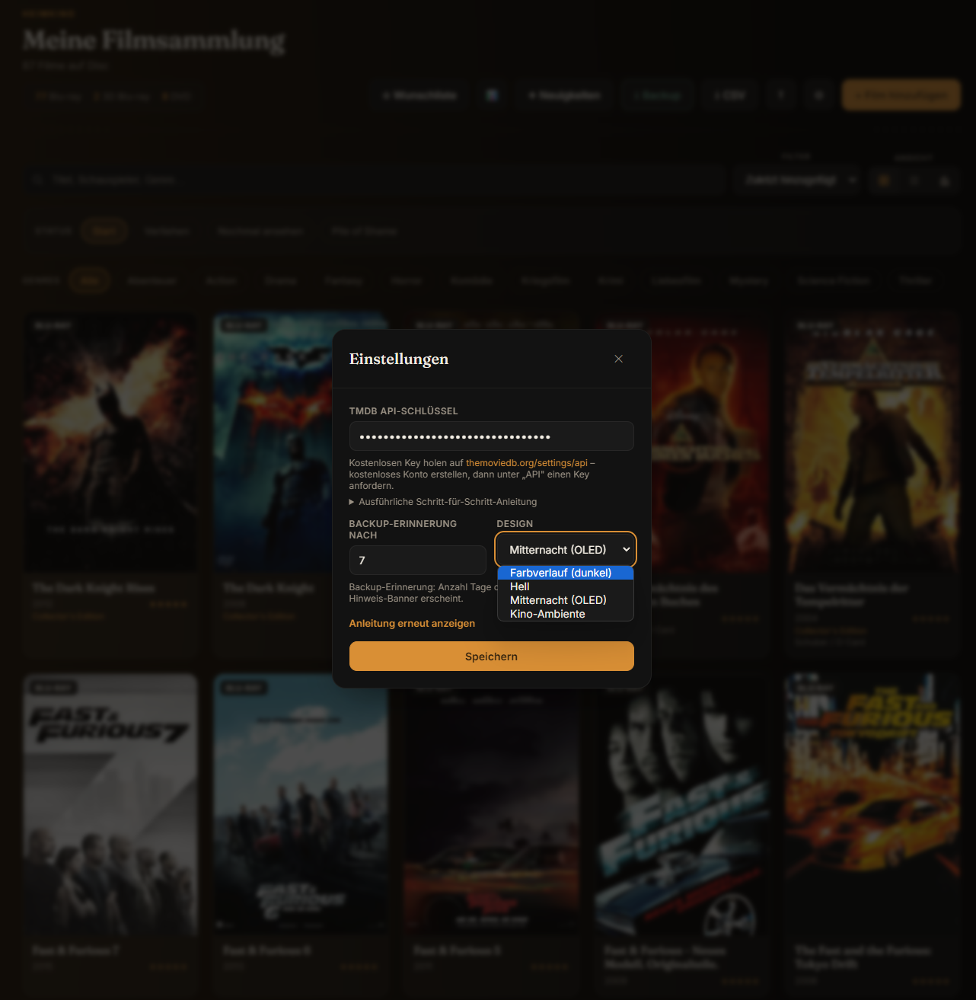
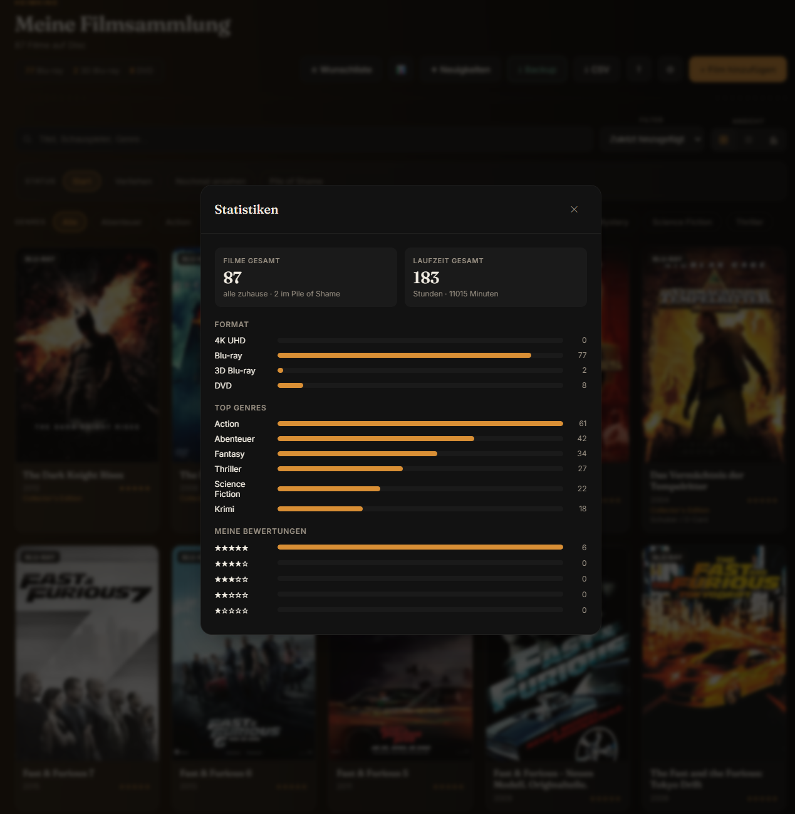
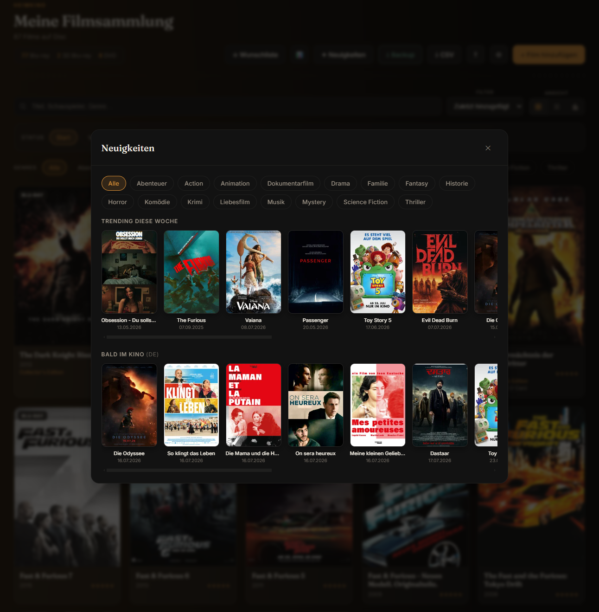

# Meine Filmsammlung

Eine private Desktop-App zur Verwaltung einer Blu-ray / 4K UHD / DVD-Sammlung,
plus Wunschliste. Für Windows.

> Dieses Repository enthält keinen Quellcode – hier gibt es nur die fertige,
> installierbare Anwendung zum Download (siehe [Releases](../../releases)).

## Download

Die aktuelle Version findest du unter **[Releases](../../releases)** – lade
die neueste `Meine-Filmsammlung-Setup-X.X.X.exe` herunter und führe sie aus.

## Installation

1. Installer ausführen.
2. Den Hinweis-/Lizenztext auf der ersten Seite lesen und bestätigen.
3. Installationsort bestätigen (Standard ist meist passend) und durchklicken.
4. Windows zeigt beim ersten Start ggf. "Unbekannter Herausgeber" – das ist
   normal bei Software ohne teures Code-Signing-Zertifikat. Einfach auf
   "Trotzdem ausführen" klicken.

Kein Node.js, kein npm nötig – der Installer bringt alles mit.

## Funktionen

- Sammlung verwalten (Blu-ray, 4K UHD, 3D Blu-ray, DVD)
- Automatische Cover, Beschreibungen & Bewertungen über TMDb (kostenloser
  API-Key nötig, in der App unter ⚙ Einstellungen einzutragen)
- Wunschliste getrennt von der eigenen Sammlung
- Regal-Ansicht mit automatischer Gruppierung von Filmreihen
- Pile of Shame (ungesehene Filme im Blick behalten)
- Vier Design-Themes
- Backup-Export/Import

Beim ersten Start zeigt die App eine kurze Einführung mit den wichtigsten
Schritten – jederzeit wieder aufrufbar über ⚙ Einstellungen → "Anleitung
erneut anzeigen".

## Screenshots

**Willkommens-Dialog** beim ersten Start


**Sammlungsansicht**


**Massenimport** – mehrere Titel auf einmal einfügen, die App gleicht sie automatisch mit TMDb ab


**Regal-Ansicht** – gruppiert Filmreihen automatisch, zeigt Vollständigkeits-Badges


**Detailansicht** eines Films


**Wunschliste**


**Einstellungen & Design-Themes**


**Statistiken**


**Neuigkeiten** – Trending & bald im Kino, direkt aus TMDb


## Sicherheit & Datenschutz

**Ist das ein Virus?** Nein. Die App ist lediglich nicht mit einem teuren
Code-Signing-Zertifikat signiert (das kostet jährlich mehrere hundert Euro,
für ein kostenloses Hobbyprojekt nicht verhältnismäßig) – daher die
"Unbekannter Herausgeber"-Warnung von Windows. Zur Kontrolle wurde die
Installer-Datei mit [VirusTotal](https://www.virustotal.com/) geprüft
(scannt mit ~70 Antiviren-Engines gleichzeitig): **[Scan-Ergebnis ansehen](https://www.virustotal.com/gui/file/e80fba9d95e4010cf73a12498dc630733a5ec7b2d242cd2503ecd3121666f3ad/detection)**.

**Welche Daten verlässt dein Gerät?** Nur Anfragen an die TMDb-API (Filmsuche,
Cover, Trailer-Links) – und nur, wenn du selbst einen API-Key hinterlegt hast.
Es gibt keine Telemetrie, kein Tracking, keine sonstige Internetverbindung.

**Wurde die Datei seit der Veröffentlichung verändert?** Nein – das lässt sich
über den SHA256-Prüfwert (Hash) unabhängig nachprüfen. Jede GitHub-Release-Datei
hat einen eindeutigen, kryptografischen "Fingerabdruck"; ändert sich auch nur
ein einziges Byte, ändert sich der komplette Hash.

Für `Meine-Filmsammlung-Setup-1.0.0.exe`:
```
SHA256: e80fba9d95e4010cf73a12498dc630733a5ec7b2d242cd2503ecd3121666f3ad
```

So kannst du selbst nachprüfen (PowerShell, nach dem Download im entsprechenden
Ordner ausführen):
```powershell
Get-FileHash "Meine-Filmsammlung-Setup-1.0.0.exe" -Algorithm SHA256
```
Der ausgegebene Wert muss exakt mit dem oben genannten übereinstimmen. Dieser
Hash ist zusätzlich identisch mit dem, den der [VirusTotal-Scan](https://www.virustotal.com/gui/file/e80fba9d95e4010cf73a12498dc630733a5ec7b2d242cd2503ecd3121666f3ad/detection)
oben für die geprüfte Datei anzeigt – ein Beleg, dass es sich exakt um die
von VirusTotal geprüfte Datei handelt, unverändert seit der Veröffentlichung.

**Wo liegen deine Daten?** Alle Daten (Filmsammlung, Wunschliste,
Einstellungen) werden ausschließlich lokal auf deinem Computer gespeichert,
unter `%APPDATA%\meine-filmsammlung\`. Es gibt keine automatische
Cloud-Sicherung – nutze regelmäßig die Export-Funktion für ein Backup.

## Updates

Die App prüft beim Start automatisch, ob eine neuere Version verfügbar ist,
und bietet an, sie herunterzuladen und zu installieren.

## Lizenz

Diese Software ist kostenlos für den privaten Gebrauch, der Quellcode wird
nicht veröffentlicht. Details siehe [LICENSE.txt](LICENSE.txt).
